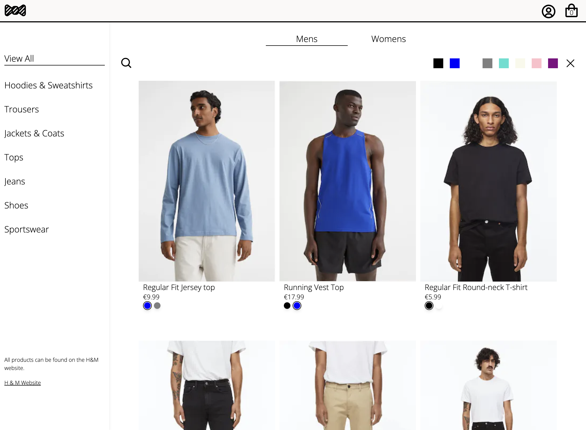

# Doyle Clothing

An online retail store built with Next JS with design and product inspiration from [H&M](https://www2.hm.com/).

Note: This application is also built using React JS and Node JS (express js). [View Source Code](https://github.com/ainedoyle20/doyle-clothing)

Users can:

- create an account / log in
- search for clothing items with the help of clothing categories and colour filters
- add clothing items to their shopping basket
- checkout using Stripe
- view order history

### Tech used

- Next JS
- TypeScript
- Firebase (authentication)
- Sanity (content management)
- Zustand (state management)
- Stripe JS
- Tailwind CSS

### View Live

[View Doyle Clothing live](https://doyle-clothing-next.vercel.app/)
